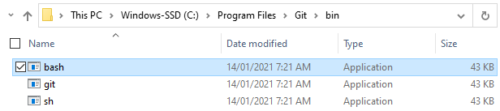
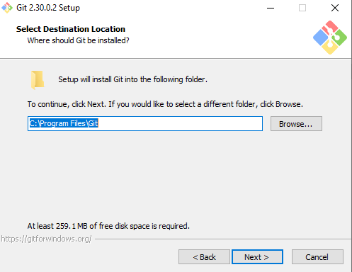
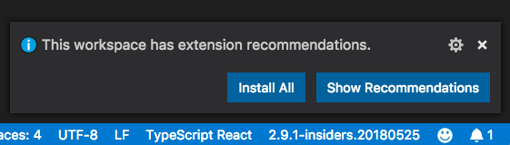

# Set up your development environment


## Before you begin

- [ ] Complete the Bootcamp [pre-work](https://coding-bootcamp-fsf-prework.readthedocs-hosted.com/en/latest/)

- [ ] Read our handy [article](./intro-to-git.md), to understand what version control systems do, what Git and GitHub are, and how we'll use them throughout the course.

- [ ] Read this [article](./bootcamp-activities.md), to learn how to organise and manage the content for the weekly in-class activities in your `bootcamp-activities` git repository.

## What does the development environment do?

This project helps you to configure your VS Code editor so you can begin working with your `bootcamp-activities` repository without having to spend lots of time installing and configuring software on your operating system.

### How does it work?

It's not critical to understand exactly how this all works, for now you can put it down to magic and fairy dust. But if you must know, we generate a development container configuration which VS Code uses to start and connect to a pre-configured development environment hosted inside a Docker container. It _mounts_ your `bootcamp-resources` directory on your local file system into the running container, giving you seamless access to the `bootcamp-resources` directory from within the container. If you'd like to know more about containers, check out this [link](https://www.docker.com/resources/what-container).

## Setting up

### Windows

1. Check the location of your [Git Bash](https://gitforwindows.org/) file

   a. After the Git Bash installation is complete (Git Bash is part of the Git for Windows package you installed during your prework), open the `C:\Program Files\Git\bin` folder and verify that it contains a `bash.exe` file

   

   If the bash file is found in this location, continue to step 2.

   b. If the bash executable is not found here, you will need to uninstall [Git](https://gitforwindows.org/) and repeat the installation (as per the instructions in your [pre-work](https://coding-bootcamp-fsf-prework.readthedocs-hosted.com/en/latest/modules/chapter2/#module-2-install-your-tools))

   > When you reach the `Select Destination Location` step during installation, verify that the location is set to `C:\Program Files\Git`
   >
   > 

2. Install and run [Docker](https://docs.docker.com/get-docker/)
3. Open a new PowerShell window as an Administrator.
4. To set up your SSH agent run the following:

   ```powershell
   Set-Service ssh-agent -StartupType Automatic # ↵ Enter
   Start-Service ssh-agent # ↵ Enter
   Get-Service ssh-agent # ↵ Enter
   ```

5. Add your existing GitHub SSH key to the agent:

   ```powershell
   ssh-add $HOME\.ssh\id_rsa # ↵ Enter
   ```

### Mac OS

1. Set Bash as the default shell for the Terminal app
   - In the Terminal app on your Mac, choose Terminal > Preferences, then click General.
   - Under “Shells open with,” select “Command (complete path),” then enter `/bin/bash`
2. Add VS Code to your `PATH`:

   - To open a new terminal, press `⌘ Command`+`Space` to open Spotlight search, type `terminal` and hit `↵ Enter`.
   - In the terminal window, copy and paste the following command and press `↵ Enter`:

     ```console
     cat << EOF >> ~/.bash_profile
     # Add Visual Studio Code (code)
     export PATH="\$PATH:/Applications/Visual Studio Code.app/Contents/Resources/app/bin"
     EOF
     ```

   - To pick up your changes, either start a new terminal, or run the following command in your current terminal:

     ```console
     source ~/.bash_profile # ↵ Enter
     ```

3. Install [Docker](https://docs.docker.com/get-docker/)

### Linux

1. Install [Docker](https://docs.docker.com/get-docker/)

## GitHub Personal Access Token

Follow the instructions [here](https://docs.github.com/en/github/authenticating-to-github/creating-a-personal-access-token) to create a personal access token, paying atttention the following steps:

- On Step 6, enter 'bootcamp-personal-access-token' for the token name
- On Step 7, select ☑ repo


## Configure VS Code and create your `bootcamp-activities` repository

1. Open a new Git Bash shell (Windows) / Terminal (Mac OS,Linux)

2. Create directory called `code` in your home directory and change into it

   ```console
   mkdir -p ~/code/ # ↵ Enter
   cd ~/code # ↵ Enter
   ```

3. Create directory called `bootcamp-resources` in your `code` and change into it

   ```console
   mkdir -p ~/code/bootcamp-resources # ↵ Enter
   ```

   1. Clone the [development environment](https://github.com/ramiruhayel/development-environment) repository into your `code` directory

   ```console
   cd ~/code # ↵ Enter
   git clone git@github.com:ramiruhayel/development-environment.git # ↵ Enter
   ```

   - _Some Mac OSX users may get the following error:_

     ```console
     xcrun: error: invalid active developer path (/Library/Developer/CommandLineTools), missing xcrun at: /Library/Developer/CommandLineTools/usr/bin/xcrun.
     ```

     To resolve it, go back to your terminal and run the folowing command:

     ```console
     $ xcode-select --install # ↵ Enter - You should then see the following output
     xcode-select: note: install requested for command line developer tools
     ```

     A window will open and you will be prompted to update Xcode Command Line tools. This step may take a while. When it completes,

     When the Xcode Command Line tools have finished installing, go back to your terminal and run:

     ```sh
     $ xcodebuild -license # ↵ Enter -- The below message will appear:
     You have not agreed to the Xcode license agreements. You must agree to both license agreements below in order to use Xcode.
     Hit the Enter key to view the license agreements at '/Applications/Xcode.app/Contents/Resources/English.lproj/License.rtf'
     ```

     Press `↵ Enter` to open the license agreement and hit the `Space` key until the below message appears:

     ```sh
     By typing 'agree' you are agreeing to the terms of the software license agreements. Type 'print' to print them or anything else to cancel, [agree, print, cancel]
     ```

     Type `agree` and hit `↵ Enter` to accept the license agreement.

     Once the installation of the XCode Command Line tools is completed, open a new terminal window and re-run:

     ```console
     git clone git@github.com:ramiruhayel/development-environment.git # ↵ Enter
     ```

4. Run the following command to open the `~/code/development-environment` folder in VS Code

   ```console
   code ~/code/development-environment # ↵ Enter
   ```

   Once VS code opens, a notification will appear in the bottom right hand corner about recommended extensions. Click 'Install All'.

   

5. **Only** if your are on a Mac:

   1. Open the `devcontainer/devcontainer.json`

   2. Below `rugArgs`, add the following `mounts` entry:

      ```json
      "mounts": [
         "source=/run/host-services/ssh-auth.sock,target=/ssh-agent,type=bind,consistency=cached"
      ],
      ```

   3. Add the following `containerEnv` property below `mounts`:

      ```json
      "containerEnv": {
         "SSH_AUTH_SOCK": "/ssh-agent",
      },
      ```

   4. Verify that the `devcontainer/devcontainer.json` look like this:

      ```json
      "runArgs": ["--env-file", ".devcontainer/devcontainer.env"],

      "mounts": [
         "source=/run/host-services/ssh-auth.sock,target=/ssh-agent,type=bind,consistency=cached"
      ],

      "containerEnv": {
         "SSH_AUTH_SOCK": "/ssh-agent",
      },
      ```

6. Update the values in `.user.env` with your details. _Be sure not to leave *any white space* before or after the = signs._

   To get the path to your `bootcamp-resources` directory, return to the Git Bash/Terminal shell you have open and run the following commands:

   ```console
   cd ~/code/bootcamp-resources # ↵ Enter
   pwd # ↵ Enter
   ```

   ```dotenv
   # User's Email & Name
   USER_NAME='John Doe'
   USER_EMAIL='john.doe@youremailprovider.com'

   # GIT Account Name
   GITHUB_ACCOUNT_NAME='john_doe_github_account'
   GITHUB_PERSONAL_ACCESS_TOKEN='123456789' # <--- Use the `bootcamp-personal-access-token` you created earlier

   # Path to 'bootcamp-resources' directory.
   # The path will look different depending on your OS:
   # Windows: '/c/Users/johndoe/code/bootcamp-resources'
   # MacOS: '/home/johndoe/code/bootcamp-resources'
   # Linux: '/home/johndoe/code/bootcamp-resources'
   #
   BOOTCAMP_RESOURCES_PATH=/home/johndoe/code/bootcamp-resources # <--- Make sure there is no trailing / e.g. ../bootcamp-resources NOT ../bootcamp-resources/

   # Path to your bash executable - you only need to set the one for your operating system
   #
   # On Windows:
   # -----------
   # Be sure to escape the '\' characters in the  path.
   # You do this by adding a second \ in front of the \ characters
   # For example:
   #    'C:\Program Files\Git\bin\bash.exe'
   # becomes
   #    'C:\\Program Files\\Git\\bin\\bash.exe'
   #
   WIN_BASH_PATH='C:\\Program Files\\Git\\bin\\bash.exe' # <-- No need to modify this if you followed instructions above ;)
   #
   # On OSX:
   # ----------
   # Default location: '/bin/bash'
   #
   OSX_BASH_PATH='/bin/bash'
   #
   # On Linux:
   # ----------
   # Default location: '/bin/bash'
   #
   LINUX_BASH_PATH='/bin/bash'

   # DO NOT CHANGE THIS VALUE!!
   STUDENT_REPO_NAME=bootcamp-activities
   ```

7. Open a new terminal `` Ctrl + Shift + ` ``

8. In the terminal, run the following commands. When prompted, enter your GitHub account password and hit ↵ Enter.

   ```console
   chmod u+x ./configure-development-environment.sh # ↵ Enter
   ./configure-development-environment.sh # ↵ Enter
   ```

9. Copy the `01-HTML-Git-CSS.zip` from `~/code/development-environment` to `~/code/bootcamp-resources/bootcamp-activities`

   ```console
   mv ~/code/development-environment/01-HTML-Git-CSS.zip ~/code/bootcamp-resources/bootcamp-activities # ↵ Enter
   ```

## Open your `bootcamp-resources` folder in the development container

1. Press `F1` to open the Command Palette.

2. Type `Remote-Containers: Reopen In Container` and press enter.

3. Your VS Code session will restart, and reopen in the development container (be patient - this may take a little while).

## Add your first activity to your `bootcamp-activities` repository

1. Open a new terminal `` Ctrl + Shift + ` ``

2. Unzip the first Activity for Week 1, Day 1 into the `bootcamp-activities` directory

   ```console
   cd ./bootcamp-activities # ↵ Enter
   unzip ./01-HTML-Git-CSS.zip # ↵ Enter
   rm -rf ./01-HTML-Git-CSS.zip # ↵ Enter
   ```

3. List the contents of the `bootcamp-activities` directory

   ```console
   ls -R # ↵ Enter
   ```

   The output should be as follows:

   ```console
   .:
   .  ..  01-HTML-Git-CSS

   ./01-HTML-Git-CSS:
   .  ..  Day-1

   ./01-HTML-Git-CSS/Day-1:
   .  ..  01-ConsoleCommands

   ./01-HTML-Git-CSS/Day-1/01-ConsoleCommands:
   .  ..  bash-terminal-commands-cheatsheet.md  README.md
   ```

   **_Your TA will send out each week's activities as you progress through the bootcamp._**

4. Add the new files to your local repository. This will stage them for the first commit

   ```console
   # Adds the files in the local repository and stages them for commit.
   # To unstage a file, use 'git reset HEAD YOUR-FILE'.

   git add .  # ↵ Enter
   ```

5. Commit the files that you've staged in your local repository:

   ```console
   # Commits the tracked changes and prepares them to be pushed to a remote repository.
   # To remove this commit and modify the file, use 'git reset --soft HEAD~1' and commit and add the file again.

   $ git commit -m "Added first Activity for Week 1"  # ↵ Enter
   [master (root-commit) 4370552] Added first Activity for Week 1
   2 files changed, 88 insertions(+)
   create mode 100644 01-HTML-Git-CSS/Day-1/01-ConsoleCommands/README.md
   create mode 100644 01-HTML-Git-CSS/Day-1/01-ConsoleCommands/bash-terminal-commands-cheatsheet.m
   ```

6. Move the default branch from `master` to `main`:

   ```console
   git branch -M main # ↵ Enter
   ```

7. Push the changes in your local repository to GitHub

   ```console
   # Pushes the changes in your local repository up to the remote repository you specified as the origin

   $ git push  # ↵ Enter
   Enumerating objects: 7, done.
   Counting objects: 100% (7/7), done.
   Delta compression using up to 12 threads
   Compressing objects: 100% (4/4), done.
   Writing objects: 100% (7/7), 1.14 KiB | 584.00 KiB/s, done.
   Total 7 (delta 0), reused 0 (delta 0)
   To github.com:robynheslop/bootcamp-activities.git
       beb8c5e..eda961a  main -> main -->
   ```

   
