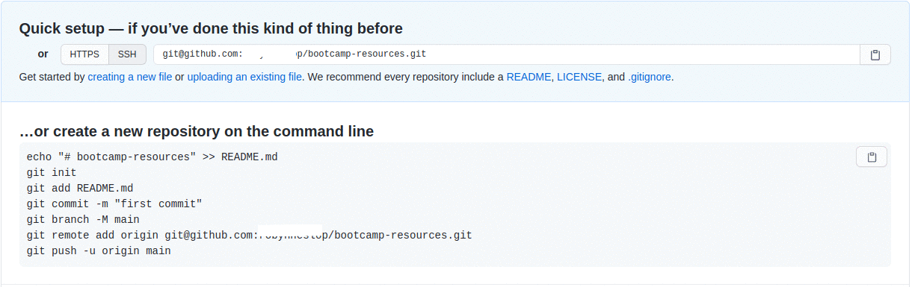

# Set up your development environment - aye

Welcome to your handy [development environment](https://github.com/ramiruhayel/development-environment). This is where we'll be housing all of our resources (code, documents, notes, etc.) as we progress through our bootcamp.

## Prerequisites

Ensure you have worked through the [pre-work](https://coding-bootcamp-fsf-prework.readthedocs-hosted.com/en/latest/modules/chapter2/#module-2-install-your-tools) for the bootcamp.

### Windows

1. Install [Git Bash](https://gitforwindows.org/)

### Mac OS

1. Set Bash as the default shell for the Terminal app
   - In the Terminal app on your Mac, choose Terminal > Preferences, then click General.
   - Under “Shells open with,” select “Command (complete path),” then enter `/bin/bash`

## Clone this repo

1. Open a new Git Bash shell (Windows) / Terminal (Mac OS,Linux)

1. Create directory called `code` in your home directory and change into it

   ```shell
   mkdir ~/code
   cd ~/code
   ```

1. Clone the [development environment](https://github.com/ramiruhayel/development-environment) repository

   ```shell
   git clone git@github.com:ramiruhayel/development-environment.git
   ```

1. Run the following command to open the `~/code/development-environment` folder in VS Code

   ```shell
   code ~/code/development-environment
   ```

1. Inspect `.vscode/settings.json` and make sure that the path to your bash executable is correct
   ```json
   {
     "terminal.integrated.shell.windows": "C:\\Program Files\\Git\\git-bash.exe",
     "terminal.integrated.shell.osx": "/usr/local/bin/bash",
     "terminal.integrated.shell.linux": "/bin/bash"
   }
   ```
1. Update the values of `GIT_USER_NAME` and `GIT_USER_EMAIL` in the `.devcontainer/devcontainer.env`

   ```env
   GIT_USER_NAME=Bootcamp-Student
   GIT_USER_EMAIL=student@bootcamp.com #Make sure it's the same email address you used to create your GitHub account
   ```

1. Open `.devcontainer/devcontainer.json`
1. Replace `ABSOLUTE_PATH_TO_BOOTCAMP_RESOURCES_DIRECTORY` with the absolute path to your bootcamp resources directory e.g. `/home/your-user-name/code/bootcamp-resources`

   ```json
   "mounts": [
    "source=ABSOLUTE_PATH_TO_BOOTCAMP_RESOURCES_DIRECTORY,target=/workspaces/development-environment/bootcamp-resources,type=bind,consistency=cached"],
   ```

1. Change into the `~/code` directory

   ```shell
   cd ~/code
   ```

## Set up your `bootcamp-resources` repository

1. [Create a new repository](https://docs.github.com/en/articles/creating-a-new-repository) on GitHub.

   - When asked to `Choose a template` select `No Template`.

   - Name your repository `bootcamp-resources`.

   - Set the repository visibility to `Public`.

     **_To avoid errors, do not initialize the new repository with README, license, or gitignore files. You can add these files after your project has been pushed to GitHub._**

2. At the top of your GitHub repository's Quick Setup page, select SSH and click the clipboard to copy the remote repository URL.
3. In the same terminal, clone the repository using the following command

   ```shell
   git clone # Paste the repostiroy URL that you copied in step 2
   ```

4. Click the clipboard next to `... or create a new repository on the command line`

   

## Open your workspace in the development container

1. Press `F1` to open the Command Palette.

2. Type `Remote-Containers: Reopen In Container` and press enter.

3. Your VS Code session will restart, and reopen in the development container.

## Add your first activity to your `bootcamp-resources` repoisitory

1. Open a new terminal `` Ctrl + Shift + ` ``

2. Press `Ctrl + V` to paste the commands we copied (in step 4 above) and press `Enter`

3. Unzip the first Activity for Week 1, Day 1 into the `bootcamp-resources` directory

   ```shell
   unzip ../development-environment/01-HTML-Git-CSS.zip
   ```

5. List the contents of the `bootcamp-resources` directory

   ```shell
   ls -aR
   ```

   The output should be as follows:

   ```shell
   .:
   .  ..  01-HTML-Git-CSS

   ./01-HTML-Git-CSS:
   .  ..  Day-1

   ./01-HTML-Git-CSS/Day-1:
   .  ..  01-ConsoleCommands

   ./01-HTML-Git-CSS/Day-1/01-ConsoleCommands:
   .  ..  bash-terminal-commands-cheatsheet.md  README.md
   ```

   **_Your TA will send out each week's activities as you progress through the bootcamp._**

6. Add the new files to your local repository. This will stage them for the first commit

   ```shell
   git add .
   # Adds the files in the local repository and stages them for commit.
   # To unstage a file, use 'git reset HEAD YOUR-FILE'.
   ```

7. Commit the files that you've staged in your local repository:

   ```shell
   git commit -m "Added first Activity for Week 1"
   # Commits the tracked changes and prepares them to be pushed to a remote repository.
   # To remove this commit and modify the file, use 'git reset --soft HEAD~1' and commit and add the file again.
   ```

8. Push the changes in your local repository to GitHub

   ```shell
   git push
   # Pushes the changes in your local repository up to the remote repository you specified as the origin

   ```

## References

- Directory trees generated [tree.nathanfriend.io](https://tree.nathanfriend.io/)
