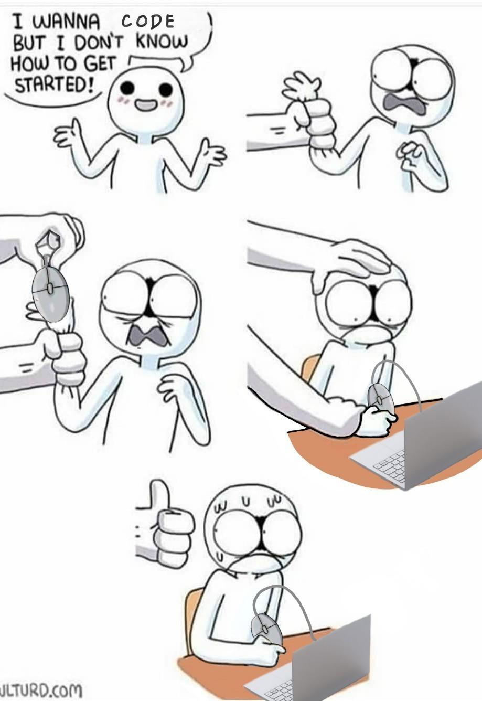
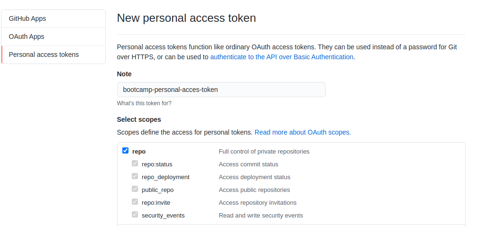
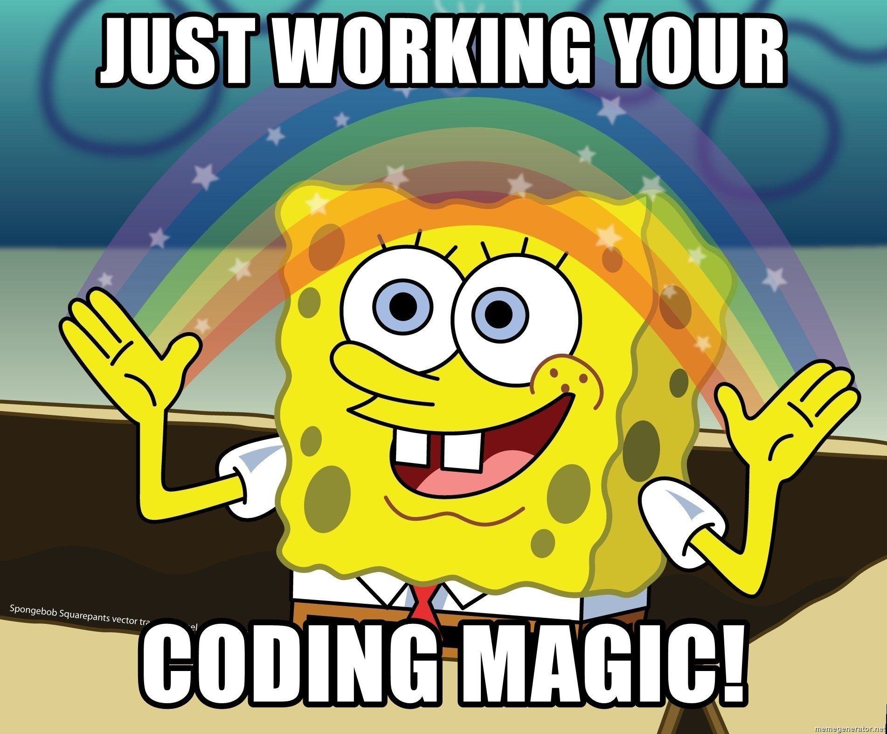

# Set up your development environment - aye

This project lets you use a Docker container as a full featured development environment. It allows you to open your day to day bootcamp repository inside a preconfigured container. If you'd like to know more about containers, check out this [link](https://www.docker.com/resources/what-container).



## Before you begin

Ensure you have worked through the [pre-work](https://coding-bootcamp-fsf-prework.readthedocs-hosted.com/en/latest/modules/chapter2/#module-2-install-your-tools) for the bootcamp.

### Windows

1. Install [Git Bash](https://gitforwindows.org/)
2. Install [Docker](https://docs.docker.com/get-docker/)
3. Open a new PowerShell window as an Administrator.
4. To set up your SSH agent run the following:

   ```powershell
   Set-Service ssh-agent -StartupType Automatic # ↵ Enter
   Start-Service ssh-agent # ↵ Enter
   Get-Service ssh-agent # ↵ Enter
   ```

5. Add your existing GitHub SSH key to the agent:

   ```powershell
   ssh-add $HOME\.ssh\id_rsa # ↵ Enter
   ```

### Mac OS

1. Set Bash as the default shell for the Terminal app
   - In the Terminal app on your Mac, choose Terminal > Preferences, then click General.
   - Under “Shells open with,” select “Command (complete path),” then enter `/bin/bash`
2. Add VS Code to your `PATH`:

   - To open a new terminal, press `⌘ Command`+`Space` to open Spotlight search, type `terminal` and hit `↵ Enter`.
   - In the terminal window, copy and paste the following command and press `↵ Enter`:

      ```sh
      cat << EOF >> ~/.bash_profile
      # Add Visual Studio Code (code)
      export PATH="\$PATH:/Applications/Visual Studio Code.app/Contents/Resources/app/bin"
      EOF
      ```

   - To pick up your changes, either start a new terminal, or run the following command in your current terminal:

      ```sh
      source ~/.bash_profile # ↵ Enter
      ```

3. Install [Docker](https://docs.docker.com/get-docker/)

### Linux

1. Install [Docker](https://docs.docker.com/get-docker/)

## GitHub Personal Access Token

Follow the instructions [here](https://docs.github.com/en/github/authenticating-to-github/creating-a-personal-access-token) to create a personal access token, paying atttention the following steps:

- On Step 6, enter 'bootcamp-personal-access-token' for the token name
- On Step 7, select ☑ repo



## Development Environment

1. Open a new Git Bash shell (Windows) / Terminal (Mac OS,Linux)

2. Create directory called `code` in your home directory and change into it

   ```shell
   mkdir ~/code # ↵ Enter
   cd ~/code # ↵ Enter
   ```

3. Clone the [development environment](https://github.com/ramiruhayel/development-environment) repository

   ```shell
   git clone git@github.com:ramiruhayel/development-environment.git # ↵ Enter
   ```

   *Some Mac OSX users may get the following error:*

   ```shell
   xcrun: error: invalid active developer path (/Library/Developer/CommandLineTools), missing xcrun at: /Library/Developer/CommandLineTools/usr/bin/xcrun. 
   ```

   To resolve it, go back to your terminal and run the folowing command:

   ```console
   $ xcode-select --install # ↵ Enter - You should then see the following output
   xcode-select: note: install requested for command line developer tools
   ```

   A window will open and you will be prompted to update Xcode Command Line tools. This step may take a while.

   Once the installation of the XCode Command Line tools is completed, open a new terminal window and re-run:

   ```shell
   git clone git@github.com:ramiruhayel/development-environment.git # ↵ Enter
   ```

4. Run the following command to open the `~/code/development-environment` folder in VS Code

   ```shell
   code ~/code/development-environment # ↵ Enter
   ```

5. Update the values in `.user.env` with your details. *Be sure not to leave _any white space_ before or after the = signs.*

   ```dotenv
   # User's Email & Name
   USER_NAME=John Doe
   USER_EMAIL=john.doe@youremailprovider.com

   # GIT Account Name
   GITHUB_ACCOUNT_NAME=john_doe_github_account
   GITHUB_PERSONAL_ACCESS_TOKEN=123456789 # <--- Use the `bootcamp-personal-access-token` you created earlier

   # Path to 'code' directory. 
   # The path will look different depending on your OS:
   # Windows: /c/Users/johndoe/code
   # MacOS: /home/johndoe/code
   # Linux: /home/johndoe/code
   #
   CODE_PATH=/home/johndoe/code # <--- Make sure there is no trailing / e.g. ../code NOT ../code/ 

   # Path to your bash executable - you only need to set the one for your operating system
   # 
   # On Windows:
   # ----------- 
   # Be sure to escape the '\' characters in the  path.
   # You do this by adding a second \ in front of the \ characters
   # For example: 
   #    'C:\Users\John Doe\AppData\Local\Programs\Git\bin\bash.exe'
   # becomes
   #    'C:\\Users\\John Doe\\AppData\\Local\\Programs\\Git\\bin\\bash.exe'
   #
   WIN_BASH_PATH='C:\\Users\\John Doe\\AppData\\Local\\Programs\\Git\bin\\bash.exe'
   #
   # On OSX: 
   # ----------
   # Default location: '/usr/local/bin/bash'
   #
   OSX_BASH_PATH='/usr/local/bin/bash'
   #
   # On Linux: 
   # ----------
   # Default location: '/bin/bash'
   #
   LINUX_BASH_PATH='/bin/bash'
   
   # DO NOT CHANGE THIS VALUE!!
   STUDENT_REPO_NAME=bootcamp-resources
   ```

6. Open a new terminal `` Ctrl + Shift + ` ``

7. In the terminal, run the following commands. When prompted, enter your GitHub account password and hit ↵ Enter.

   ```shell
   chmod u+x ./configure-development-environment.sh # ↵ Enter
   ./configure-development-environment.sh # ↵ Enter
   ```

## Open your workspace in the development container

1. Press `F1` to open the Command Palette.

2. Type `Remote-Containers: Reopen In Container` and press enter.

3. Your VS Code session will restart, and reopen in the development container (be patient - this may take a little while).

## Add your first activity to your `bootcamp-resources` repoisitory

1. Open a new terminal `` Ctrl + Shift + ` ``

2. Unzip the first Activity for Week 1, Day 1 into the `bootcamp-resources` directory

   ```shell
   unzip ../01-HTML-Git-CSS.zip # ↵ Enter
   ```

3. List the contents of the `bootcamp-resources` directory

   ```shell
   ls -R # ↵ Enter
   ```

   The output should be as follows:

   ```shell
   .:
   .  ..  01-HTML-Git-CSS

   ./01-HTML-Git-CSS:
   .  ..  Day-1

   ./01-HTML-Git-CSS/Day-1:
   .  ..  01-ConsoleCommands

   ./01-HTML-Git-CSS/Day-1/01-ConsoleCommands:
   .  ..  bash-terminal-commands-cheatsheet.md  README.md
   ```

   **_Your TA will send out each week's activities as you progress through the bootcamp._**

4. Add the new files to your local repository. This will stage them for the first commit

   ```shell
   git add . # ↵ Enter
   # Adds the files in the local repository and stages them for commit.
   # To unstage a file, use 'git reset HEAD YOUR-FILE'.
   ```

5. Commit the files that you've staged in your local repository:

   ```shell
   git commit -m "Added first Activity for Week 1" # ↵ Enter
   # Commits the tracked changes and prepares them to be pushed to a remote repository.
   # To remove this commit and modify the file, use 'git reset --soft HEAD~1' and commit and add the file again.
   ```

6. Configure your local repository:

   ```shell
   git branch -M main # ↵ Enter
   git remote add origin git@github.com:robynheslop/bootcamp-resources.git # ↵ Enter
   # Set the default branch to main
   # Set the upstream to your bootcamp-resources repository
   ```

7. Push the changes in your local repository to GitHub

   ```shell
   git push -u origin main # ↵ Enter
   # Pushes the changes in your local repository up to the remote repository you specified as the origin

   ```

   
