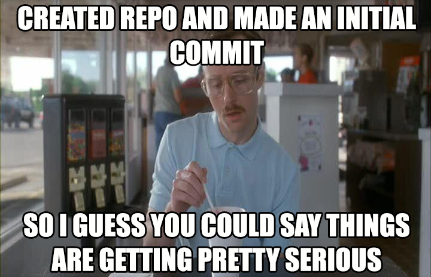

# How do I organise and backup the work I do in class?

During each day's class, your instructor will help you grasp the concepts being taught be working through helpful examples, called _activities_. After each instructor led _activity_, you and your classmates will be asked to split up into teams and attempt one or more activities on your own. Putting what you have been taught into practice is a great way to increase your retention and recall of the subject matter.

To ensure that the work you do during class is not lost, it is best to keep a copy of it in a secondary location, ideally not on the same laptop that you use for your classwork.

Git is a content versioning system that is used by most software developers. It allows you to 'save' the incremental changes you make to your files both locally (e.g. on your laptop) as well as on a 'remote' location (i.e. on a server that is not managed by you - e.g. GitHub). Making sure the changes you are making are stored elsewhere is a great idea, and helps guard against the unpleasant, yet very real threat of data loss - think of what would happen if you spilled a glass of water on your laptop and lost all the months of work you'd done!

In summary, we want you to be frequently backing up the work you do during class. The place we'll be backing up our work to is [GitHub](https://github.com/) and we'll be using the [Git](https://git-scm.com/) command line tools to save changes our work locally and to backup our changes to GitHub's servers.

## Your `bootcamp-activities` repository

### Before class

At the start of each week, you will need to create a directory within `bootcamp-activities` with the week's title. For example, week 1's topic is `01-HTML-Git-CSS`. Create three directories inside `01-HTML-Git-CSS`: `Day-1`,`Day-2` and `Day-3`, one for each day of class.

For example:

```console
.
└── bootcamp-activities/
    └── 01-HTML-Git-CSS/ 
        └── Day-1/
        └── Day-2/
        └── Day-3/
```

Your TA will upload a ZIP file to Slack containing all the instructor and student led activities for the upcoming class. Download and unzip these files into your `bootcamp-activities` repository in the appropriate day's folder.

Your repository directory will now look something like this:

```console
..
└── bootcamp-activities/
    └── 01-HTML-Git-CSS/        # Week
        └── Day-1/              # Day
            ├── Activity-1/     # Activity
            └── Activity-2/     
```

### After class

You will need to add, stage and commit the changes made in your local repository to your GitHub repository.

1. Add the new files to your local repository. This will stage them for the first commit

   ```console
   # Adds the files in the local repository and stages them for commit.
   # To unstage a file, use 'git reset HEAD YOUR-FILE'.

   git add .  # ↵ Enter
   ```

2. Commit the files that you've staged in your local repository.

   ```console
   # Commits the tracked changes and prepares them to be pushed to a remote repository.
   # To remove this commit and modify the file, use 'git reset --soft HEAD~1' and commit and add the file again.

   $ git commit -m "Added first Activity for Week 1"  # ↵ Enter
   [master (root-commit) 4370552] Added first Activity for Week 1
   2 files changed, 88 insertions(+)
   create mode 100644 01-HTML-Git-CSS/Day-1/01-ConsoleCommands/README.md
   create mode 100644 01-HTML-Git-CSS/Day-1/01-ConsoleCommands/bash-terminal-commands-cheatsheet.m
   ```

3. Push the changes in your local repository to GitHub.

   ```console
   # Pushes the changes in your local repository up to the remote repository you specified as the origin

   git push  # ↵ Enter
   ```

## The class GitLab repository

Think of the `WAUS-PERTH-FSF-PT-02-2021-U-C` _GitLab_ respository (yep, that's its actual name!) as your text book, complete with worked solutions.

Your `bootcamp-activities` _GitHub_ repository is akin to your personal workbook; this is where you'll keep your solutions to the in-class activities as well as any notes you may take during class (we drop _a lot_ of wisdom bombs).

>*Important*: **Do not** make chages to the content in the `WAUS-PERTH-FSF-PT-02-2021-U-C` _GitLab_ respository. All your notes and attempts at the in-class activities belong in your personal `bootcamp-activities` _GitHub_ repository.

The `WAUS-PERTH-FSF-PT-02-2021-U-C` _GitLab_ respository is updated several times a week:

1. At the start of each week, your TA will add important resources, such as presentation slides, career services information and homework instructions.

2. After each class, the TA will add all of the in-class activities, including the solutions.

To keep your local copy of `WAUS-PERTH-FSF-PT-02-2021-U-C` repository up to date, pull down the latest version at the start of each week and at the end of each class:

```console
$ git pull --fast-forward
remote: Enumerating objects: 1, done.
remote: Counting objects: 100% (1/1), done.
remote: Total 1 (delta 0), reused 0 (delta 0), pack-reused 0
Unpacking objects: 100% (1/1), 622 bytes | 622.00 KiB/s, done.
From github.com:robynheslop/bootcamp-activities
   eda961a..5ac203b  main       -> origin/main
Updating eda961a..5ac203b
Fast-forward
 README.md | 4 +++-
 1 file changed, 3 insertions(+), 1 deletion(-)
```



## References

Directory trees generated [tree.nathanfriend.io](https://tree.nathanfriend.io/)
